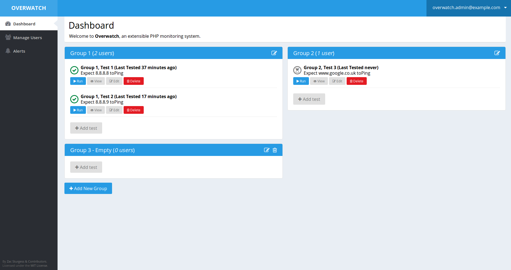

# Overwatch

Overwatch is an extensible PHP monitoring system built on top of the excellent [Symfony Framework](https://github.com/symfony/symfony-standard), with a frontend interface engineered in [AngularJS](https://angularjs.org/).

Overwatch is a creation of Zac Sturgess. See also the [list of contributors](https://github.com/zsturgess/overwatch/graphs/contributors).

**Warning:** Overwatch is abandonware and is no longer recieving regular updates. If you are running a fork that you are keeping up-to-date, please submit a PR to this repository to replace this message with a link to your fork.

Installation
------------

All the [installation instructions](app/Resources/docs/installing.md) are located in the documentation at:

    app/Resources/docs/installing.md

Documentation
-------------

The bulk of the [documentation](app/Resources/docs/index.md) is located in markdown files in the code:

    app/Resources/docs/index.md

License
-------

This project is under the MIT license. See the [complete license](LICENSE):

    LICENSE

Reporting an issue or a feature request
---------------------------------------

Issues and feature requests are tracked in the [Github issue tracker](https://github.com/zsturgess/overwatch/issues).
