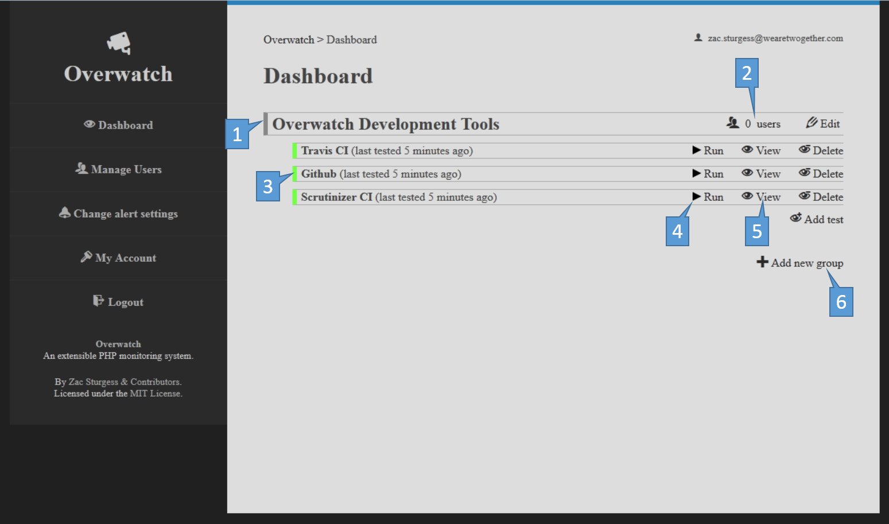
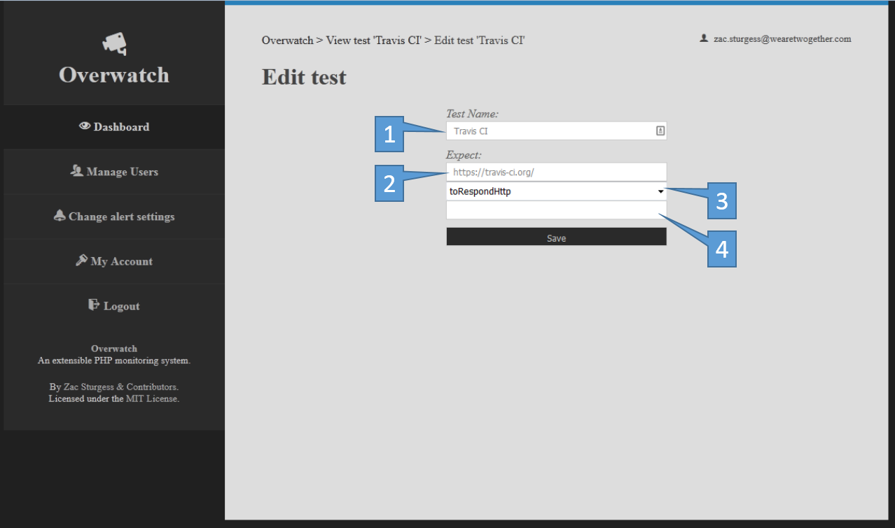
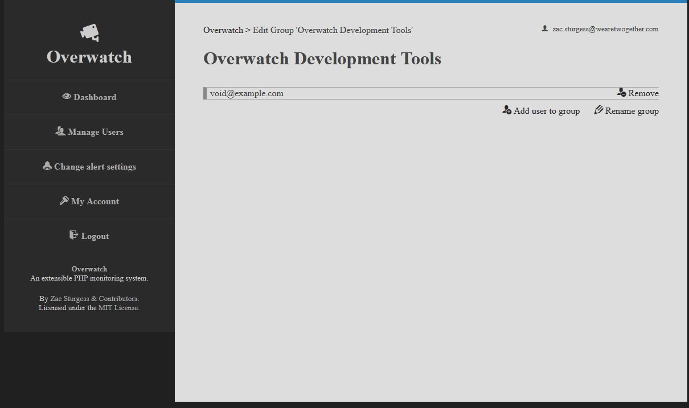
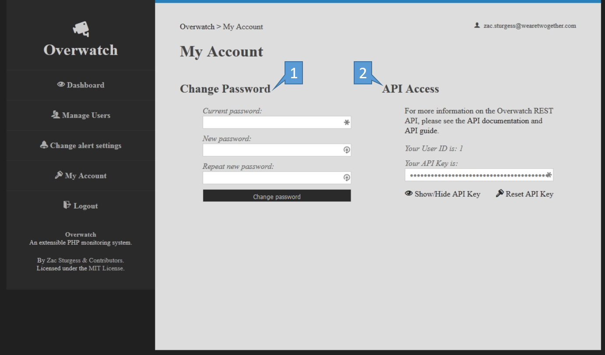
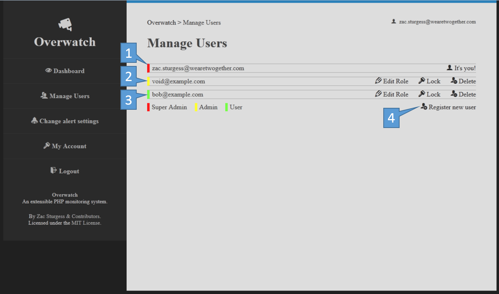

#Overwatch
##An introduction to testing
Tests in Overwatch take one of two forms:
- _Expect xxx toBeMadeOfXs_
- _Expect xxx toBeBefore yyy_

The `toXxx` part is called the _expectation_. The part before the expectation is called the _actual value_. The part after the expectation is called the _expected value_, and may be optional, depending on the expectation.

Test results have a status:
- _Pass_ (shown in green) - The test completed successfully
- _Unsatisfactory_ (shown in yellow) - The test completed successfully, but encountered an unexpected result not considered a failure
- _Fail_ (shown in red) - The test encountered a result considered a failure, as according to the test's expectation.
- _Error_ (shown in red) - The test failed to execute. The most common cause is attempting to run an expectation that requires administrative permissions as a non-admin.

##Expectations
Overwatch comes bundled with the following expectations:
- [toPing](expectations/to_ping.md) - Expects the hostname or IP address given as the actual to respond to an ICMP ping
- [toResolveTo](expectations/to_resolve_to.md) - Expects the hostname given as the actual to have a DNS record with the value of the expected
- [toRespondHttp](expectations/to_respond_http.md) - Expects the URL given as the actual to respond with a HTTP code

Overwatch is also set up in such a way to allow the creation of 3rd Party "addon" expectations, see [Extending Overwatch](extending.md)

##Getting test results
Tests are run by the overwatch:tests:run command (`php app/console overwatch:tests:run`) and the results are saved into the database.

Overwatch will pass test results off to _result reporters_ as it saves them to the database. Overwatch comes bundled with the following result reporters:
- [EmailReporter](result-reporters/email_reporter.md) - Will send a notification e-mail to each user in the same group as the test, if the user's notification settings allow
- [SmsReporter](result-reporters/sms_reporter.md) - Will send an SMS alert to each user in the same group as the test, as long as the user has provided a telephone number and their notification settings allow.

Overwatch is also set up in such a way to allow the creation of 3rd Party "addon" result reporters, see [Extending Overwatch](extending.md)

##Overwatch REST API
In addition to being extensible, Overwatch is designed to be hackable, and as such exposes a [RESTful API](api.md).

##Tour
###Dashboard

Tests are put into named groups [1], not only to organise them, but also so that you can add users to groups [2] to limit them to only see tests that matter to them.
On the dashboard, tests are shown with a colour indicator for the result of their last run [3]. These tests can be run on-demand [4], or you can dive into more detail and historical test results [5].
New groups and tests can also be set up from the dashboard [6]

Some tests require administrator rights to run and may fail when run manually if your web server is running with optimal settings.

###View test

Each test run is given a line with a colour to indicate the result's status [1]. The age of the result is shown, and an exact timestamp is shown when hovering the relative age [2]. The test's name and parameters (Expected value, Expectation and Actual value) can be edited [3].

###Edit test

Each test can be given a friendly name shown to users [1]. The actual value [2], expectation [3] and expected value [4] can also be configured (see _[An introduction to testing](https://github.com/zsturgess/overwatch/blob/master/app/Resources/docs/index.md#an-introduction-to-testing)_ for an explanation of these terms).

###Edit group

From the Edit Group screen, users may be added or removed from the group and the group may be renamed.

###My Account

The My Account screen is split into 2 halves. On the left, you can change your own password [1]. On the right, you can obtain and reset credentials for use with the [Overwatch REST API](api.md) [2].

###Manage Users

You can set up and manage user roles from here.
[1] _Super admins_ (in red) have full access to all groups, tests and settings on your Overwatch installation.
[2] _Admins_ (in yellow) can view, create, edit, manually run and delete tests in the groups they are assigned to.
[3] _Users_ (in green) can only view test results in groups they are assigned to.

Users may be locked to prevent them logging in or using the API, or even deleted if no longer required.
New users may be added by providing their e-mail address [4]. They will be sent an e-mail with instructions to set up their Overwatch account.
